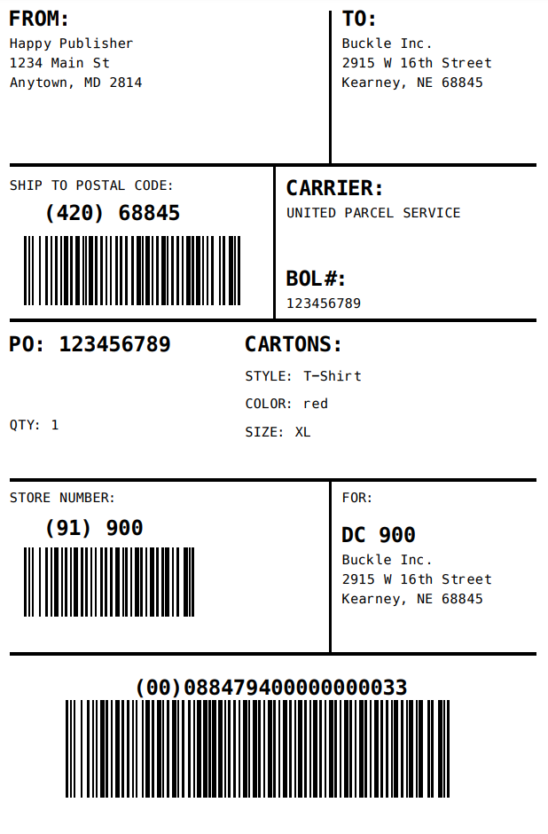

# GS1-128 / Serial Shipping Container Code (SSCC) Label Generation

This repo includes code for a single [Stedi Function](https://www.stedi.com/docs/functions) (called `labels-gs1`) designed to generate a GS1 Logistic Label in ZPL (Zebra) and PDF formats.

## About the GS1 Logistic / SSCC label

- [An Introduction to the Serial Shipping Container Code (SSCC)](https://www.gs1us.org/content/dam/gs1us/documents/industries-insights/standards/An-Introduction-to-the-Serial-Shipping-Container-Code-SSCC.pdf): Provides a high-level overview of the SSCC code.
- [GS1 Logistic Label Guideline](https://www.gs1.org/docs/tl/GS1_Logistic_Label_Guideline.pdf): Complete technical specification for the SSCC / Logistic Label.
- [GS1 Identification Keys in Transport & Logistics](https://www.gs1.org/docs/tl/T_L_Keys_Implementation_Guideline.pdf): Details on usage in Transportation and Logistics.

## Using this function

**NOTE:** This function is intended for reference purposes only.

The function expects an input as follows:

```json
{
  "shipFrom": {
    "line1": "Happy Publisher",
    "line2": "1234 Main St",
    "city": "Anytown",
    "state": "MD",
    "zipCode": "2814"
  },
  "shipTo": {
    "line1": "Buckle Inc.",
    "line2": "2915 W 16th Street",
    "city": "Kearney",
    "state": "NE",
    "zipCode": "68845"
  },
  "carrier": {
    "name": "United Parcel Service",
    "bol": "123456789"
  },
  "purchaseOrder": {
    "number": "123456789",
    "quantity": 1,
    "cartons": {
      "style": "T-Shirt",
      "color": "red",
      "size": "XL"
    }
  },
  "gs1": {
    "companyPrefix": "884794"
  }
}
```

And will generate a label that looks like:



### Function flow

When invoked with a JSON payload as detailed above, the function will:

1. Use [Stash](https://www.stedi.com/docs/stash), Stedi's key-value store, to increment and persist a unique serial number (for each unique `gs1.companyPrefix` value), using the Stash keyspace configured in the `STASH_KEYPSPACE_NAME_GS1` environmental variable.

2. Combine the GS1 company prefix, along with the serial number, and calculate [a check digit](https://www.gs1.org/services/how-calculate-check-digit-manually) to generate a valid GS1-128 number.

3. Use the open source (jszpl)[https://github.com/DanieLeeuwner/JSZPL] npm module to generate the ZPL file needed to print the SSCC label on a ZPL-capable printer.

4. Convert the ZPL to PDF using the free [Labelary.com API](http://labelary.com/), in case a PDF is needed.

5. Persist the ZPL and PDF files in [a Stedi Bucket](https://www.stedi.com/docs/buckets), as configured in the `LABEL_BUCKET_NAME` environmental variable.

6. Finally, return the paths of the two newly created files as its output.

## Setup & deploy

1. Rename the `.env.example` file to `.env` and update the following environment variables:

   - `STEDI_API_KEY`: A Stedi API key is required for authentication. You
     can [generate an API key](https://www.stedi.com/app/settings/api-keys) in your Stedi account.
   - `STASH_KEYPSPACE_NAME_GS1`: A Stash keyspace name, where the function will persist unique serial numbers for inclusion on the label.
   - `LABEL_BUCKET_NAME`: A Stedi Bucket name, where the function will persist the generated label in both `.zpl` and `.pdf` formats.

   Example `.env` file

   ```
    STEDI_API_KEY=<YOUR_STEDI_API_KEY>
    LABEL_BUCKET_NAME=<A_STEDI_BUCKET_NAME>
    STASH_KEYPSPACE_NAME_GS1=<A_STEDI_KEYSPACE_NAME>
   ```

1. Run the following command in the root directory:

```bash
npm run deploy
```

## Executing the Stedi Function remotely

You can integrate this Stedi function into an external application by using the [Functions SDK](https://www.stedi.com/docs/functions/sdk) or by making an HTTP call directly using [the API](https://www.stedi.com/docs/api/functions).

Here's example code that uses the Stedi Functions SDK to invoke the function:

```typescript
import {
  FunctionsClient,
  InvokeFunctionCommand,
  InvocationType,
} from "@stedi/sdk-client-functions";

const functions = new FunctionsClient({
  region: "us",
  apiKey: "<YOUR_STEDI_API_KEY>",
});

const response = await functions.send(
  new InvokeFunctionCommand({
    functionName: "labels-gs1",
    invocationType: InvocationType.SYNCHRONOUS,
    payload: {
      shipFrom: { ... },
      shipTo: { ... },
      carrier: { ... },
      purchaseOrder: { ... },
      gs1: { ... },
    },
  })
);

console.log(response);
```
